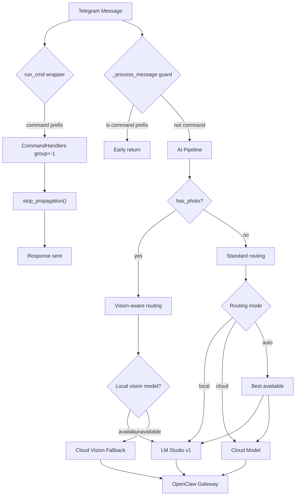

# Krab Phase 9+ -- Unified Recovery Plan

## Architecture Target




## Delivery Strategy (3 Stages)

- **Stage A** (low risk, immediate effect): Command isolation + !help + !model commands
- **Stage B** (medium risk, API changes): LM Studio v1 + VRAM management + vision fallback
- **Stage C** (broader): Cross-channel audit, !ops, !status enrichment, tests

---

## Stage A: Commands and Isolation

### A1. Two-Layer Stop Propagation

**Files**: [src/userbot_bridge.py](src/userbot_bridge.py)

**Layer 1** -- Fix `run_cmd` wrapper (~line 122) to ALWAYS call `stop_propagation()`:

```python
async def run_cmd(handler, m):
    try:
        await handler(self, m)
    except UserInputError as e:
        await m.reply(e.user_message or str(e))
    except Exception as e:
        logger.error("command_error", handler=handler.__name__, error=str(e))
        await m.reply(f"Ошибка: {str(e)[:200]}")
    finally:
        m.stop_propagation()
```

**Layer 2** -- Add safety guard at top of `_process_message` (~line 318):

```python
text = message.text or message.caption or ""
if text and text.lstrip()[:1] in ("!", "/", "."):
    cmd_word = text.lstrip().split()[0].lstrip("!/.").lower()
    if cmd_word in self._known_commands:
        return
```

Add `_known_commands: set` as class attribute, populated in `_setup_handlers()`.

**Cleanup**: Remove individual `stop_propagation()` calls from the 7 handlers that currently have them (search, remember, recall, ls, read, write, agent).

### A2. Restore !help Command

**Files**: [src/handlers/command_handlers.py](src/handlers/command_handlers.py), [src/handlers/**init**.py](src/handlers/__init__.py), [src/userbot_bridge.py](src/userbot_bridge.py)

- Add `handle_help(bot, message)` with structured categories matching legacy v7.2 format
- Sections: Core, AI/Model, Tools, System, Dev
- Mark web-only or planned features as "(soon)" or "(web)"
- Export in `__init__.py`, register in `_setup_handlers()`

### A3. Restore !model Commands (Full Subcommands)

**Files**: [src/handlers/command_handlers.py](src/handlers/command_handlers.py), [src/modules/web_router_compat.py](src/modules/web_router_compat.py)

Rewrite `handle_model` to support:

- `!model` (no args) -- full routing status: mode, active model, cloud model, last route info
- `!model local` -- set `config.FORCE_CLOUD = False`, internal `force_mode = "force_local"`
- `!model cloud` -- set `config.FORCE_CLOUD = True`
- `!model auto` -- set `config.FORCE_CLOUD = False`, clear force_mode
- `!model load <name>` -- load via `model_manager.load_model()` with VRAM guard
- `!model unload` -- unload via `model_manager.free_vram()`
- `!model scan` -- discover and list all available models (local + cloud)

Use `model_manager` singleton only. Sync with `web_router_compat.set_force_mode()`. Return human-readable response with current state and diagnostics on failure.

---

## Stage B: API, VRAM, Vision

### B1. LM Studio REST API v1 Migration (with Fallback)

**Files**: [src/model_manager.py](src/model_manager.py), [src/core/local_health.py](src/core/local_health.py)

**URL normalization**: Strip trailing slash from `config.LM_STUDIO_URL` to prevent double-slash bugs.

**load_model** -- endpoint fallback chain:

1. `POST {base}/api/v1/models/load` (newer LM Studio)
2. `POST {base}/v1/models/load` (older LM Studio)
3. Payload: `{"model": model_id}`

**unload_model** -- endpoint fallback chain:

1. `POST {base}/api/v1/models/unload` with `{"instance_id": model_id}`
2. `POST {base}/v1/models/unload` with `{"model": model_id}`

**list models** -- update `local_health.py`:

1. `GET {base}/api/v1/models` (newer)
2. `GET {base}/v1/models` (fallback)

All calls via `httpx.AsyncClient` with configurable timeout.

### B2. Smart VRAM Management

**Files**: [src/model_manager.py](src/model_manager.py)

Add `asyncio.Lock` around load/unload operations to prevent races.

New methods:

- `get_loaded_models() -> list[str]` -- query LM Studio for loaded models
- `free_vram()` -- unload all loaded models, sync `_current_model` state

Update `load_model()` flow:

1. If requested model already loaded -- skip, return True
2. If another model loaded -- auto-evict it first
3. Check RAM via `can_load_model()`
4. If insufficient -- call `free_vram()`, wait 2s, retry
5. Load with endpoint fallback chain

Replace `unload_all()` with proper `free_vram()` implementation.

### B3. Vision-Aware Routing (Local -> Cloud Fallback)

**Files**: [src/model_manager.py](src/model_manager.py), [src/core/model_router.py](src/core/model_router.py), [src/openclaw_client.py](src/openclaw_client.py), [src/core/local_health.py](src/core/local_health.py)

**Propagate `has_photo`**:

- `openclaw_client.send_message_stream()` passes `has_photo=bool(images)` to `model_manager.get_best_model(has_photo=...)`
- `model_manager.get_best_model()` forwards to `ModelRouter.get_best_model(has_photo=...)`

**Vision detection** in `local_health.py` -- extend patterns:

- `"vl"` in model_id (Qwen2-VL etc.)
- `"vision"` in model_id
- `"glm-4"` in model_id (GLM-4V family)

**Routing logic** when `has_photo=True`:

1. If mode allows local -- check for loaded model with `supports_vision`
2. If local vision available -- use it
3. If not -- fallback to cloud vision (`google/gemini-2.5-flash`)

**Fix LM Studio direct fallback** in `openclaw_client.py` (~line 294): preserve vision message format when falling back to LM Studio directly.

**Add route telemetry**: log `{mode, has_photo, selected_model, fallback_reason}` for diagnostics.

---

## Stage C: Polish and Audit

### C1. Enrich !status

**File**: [src/handlers/command_handlers.py](src/handlers/command_handlers.py)

Add to `handle_status`: LM Studio status, current loaded model, routing mode, OpenClaw version from `/health`.

### C2. Add !ops Command

**File**: [src/handlers/command_handlers.py](src/handlers/command_handlers.py)

Basic `handle_ops` showing usage stats from `cost_analytics` / `observability` module. Register + export.

### C3. Cross-Channel Audit

Verify consistent model logic across:

- Telegram (`userbot_bridge.py`)
- Web panel (`web_app.py`, `web_router_compat.py`)
- OpenClaw gateway paths

Ensure `local/cloud/auto` and vision fallback work identically in all channels.

### C4. Tests

- Unit: stop-propagation guard, !help/!model parsing, LM Studio v1 endpoints, free_vram, vision routing
- Integration: full command flow in Telegram path, photo + no local vision scenario
- Smoke: no double responses on commands, health checks pass

### C5. Minor Fixes

- Remove duplicate `if not full_response` block in `userbot_bridge.py`
- Persist routing mode to `runtime_state.json` (survives restart)
- Sync default `LM_STUDIO_URL` with config policy (no hardcoded IPs in code)

---

## File Change Summary

- **src/userbot_bridge.py** -- fix run_cmd, add command guard, register new handlers, _known_commands set
- **src/handlers/command_handlers.py** -- add handle_help, handle_ops, rewrite handle_model, enrich handle_status
- **src/handlers/init.py** -- export new handlers
- **src/model_manager.py** -- LM Studio v1 endpoints with fallback, asyncio.Lock, free_vram(), get_loaded_models(), has_photo routing, URL normalization
- **src/openclaw_client.py** -- pass has_photo, preserve vision format in LM Studio fallback
- **src/core/model_router.py** -- accept has_photo in get_best_model()
- **src/core/local_health.py** -- extend vision patterns, /api/v1 fallback endpoints
- **src/modules/web_router_compat.py** -- sync force_mode with new !model commands
- **tests/** -- new and updated unit/integration tests

